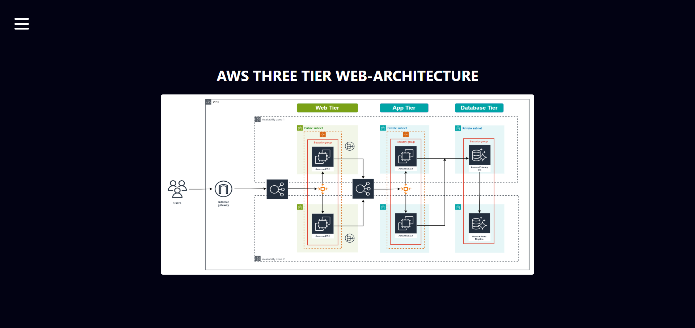
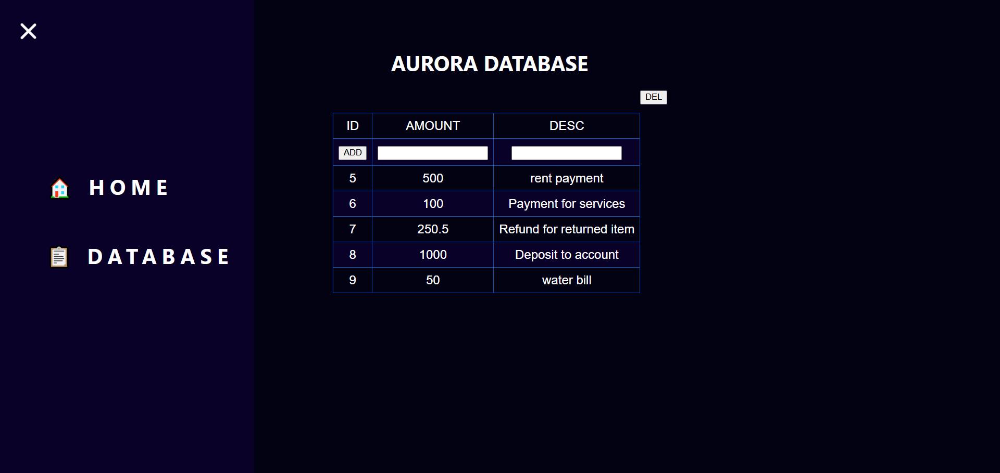

# AWS-Three-Tier-Web-Architecture-Project

## Overview
This project implements a highly scalable, secure, and fault-tolerant three-tier web architecture on AWS. The architecture consists of the Web Tier, App Tier, and Database Tier, all deployed using best practices for networking, security, and automation. It ensures high availability, seamless scalability, and easy management, with optimized performance for each tier. The setup involves deploying and configuring resources for the database, application, and web layers, leveraging tools like **AWS**, **EC2**, **RDS**, **Elastic Load Balancer**, **Auto Scaling Groups**, **S3**, **VPC**, **Security Groups**, and **CloudWatch** to achieve these goals.

---

## Table of Contents
1. [Architecture Diagram](#architecture-diagram)
2. [Setup](#setup)
3. [Networking and Security](#networking-and-security)
4. [Database Deployment](#database-deployment)
5. [App Tier Setup](#app-tier-setup)
6. [App Tier Deployment](#app-tier-deployment)
7. [Web Tier Setup](#web-tier-setup)
8. [Web Tier Deployment](#web-tier-deployment)
9. [Testing Step: Verify Web Server Load Balancer](#testing-step-verify-web-server-load-balancer)
10. [Troubleshooting Guide](#troubleshooting-guide)
11. [Conclusion](#conclusion)

---
## Architecture Diagram


---
## Setup
### Step 1: Clone Repository
```bash
git clone https://github.com/gitkailash/AWS-Three-Tier-Web-Architecture-Project.git
```

### Step 2: Create S3 Bucket
- Create an S3 bucket to store application code and configuration files.

### Step 3: Create IAM Role
- **Role Name:** `EC2_S3_ReadOnly_SSM_Role`
- **Policies:**
  - AmazonS3ReadOnlyAccess
  - AmazonSSMManagedInstanceCore

---

## Networking and Security

### Step 1: Create VPC
- CIDR Block: `10.0.0.0/16`

### Step 2: Create Subnets
| Subnet Name                 | CIDR Block    | Type      | Availability Zone |
|-----------------------------|---------------|-----------|-------------------|
| public-web-subnet-AZ-1      | 10.0.0.0/20   | Public    | us-east-1a        |
| public-web-subnet-AZ-2      | 10.0.16.0/20  | Public    | us-east-1b        |
| private-app-subnet-AZ-1     | 10.0.32.0/20  | Private   | us-east-1a        |
| private-app-subnet-AZ-2     | 10.0.48.0/20  | Private   | us-east-1b        |
| private-db-subnet-AZ-1      | 10.0.64.0/20  | Private   | us-east-1a        |
| private-db-subnet-AZ-2      | 10.0.80.0/20  | Private   | us-east-1b        |

### Step 3: Create Internet Gateway
- Attach the Internet Gateway to the VPC.

### Step 4: Create NAT Gateways
- Create a NAT Gateway in each Availability Zone with Elastic IPs.

### Step 5: Route Tables
- **Public Route Table:**
  - Route: `0.0.0.0/0` to Internet Gateway
  - Associate with Public Subnets.
- **Private Route Tables:**
  - Route: `0.0.0.0/0` to NAT Gateway (specific to AZ)
  - Associate with Private Subnets.

### Step 6: Security Groups
| Security Group Name    | Rules                                                                                   |
|------------------------|-----------------------------------------------------------------------------------------|
| InternetFacing-LB-SG   | Allow HTTP (80) from anywhere (IPv4 & IPv6).                                            |
| WebTier-SG             | Allow HTTP from `InternetFacing-LB-SG` and your IP.                                    |
| Internal-LB-SG         | Allow HTTP from `WebTier-SG`.                                                          |
| AppTier-SG             | Allow custom TCP (4000) from `Internal-LB-SG` and your IP.                             |
| DB-SG                  | Allow MySQL/Aurora (3306) from `AppTier-SG` and your IP.                               |

---

## Database Deployment
### Step 1: Create Subnet Group
- Name: `three-tier-db-subnet-group`
- Subnets: Private DB Subnets in both AZs.

### Step 2: Create Aurora Database
- **Choose a database creation method:** Standard create
- **Engine options:** Aurora (MySQL Compatible)
- **Templates:** Dev/Test
- **Engine:** Aurora (MySQL Compatible)
- **Credentials:**
  - Username: `username`
  - Password: `password`
- **Multi-AZ Deployment:** Enabled
- **Virtual private cloud (VPC):** `Your VPC`
- **DB subnet group:** `three-tier-db-subnet-group`
- **VPC Security Group:** `DB-SG`


---

## App Tier Setup
### Step 1: Launch AppServer EC2 Instance
- **AMI:** Amazon Linux
- **Instance Type:** t2.micro
- **Edit Network Setting**:
  - **VPC:** `Your VPC`
  - **Subnet:** `private-app-subnet-AZ-1`
  - **Security Group:** `AppTier-SG`
- **Advance Setting:**
  - **IAM instance profile:** `EC2_S3_ReadOnly_SSM_Role`
- **Lunch instance** 

### Step 2: Connect to AppServer instance  (Session Manager)
Instructions for Setting Up the Application
```bash
# Switch to EC2 user
sudo -su ec2-user

# Test network connectivity
ping 8.8.8.8

# Download the MySQL repository package
sudo wget https://dev.mysql.com/get/mysql80-community-release-el9-1.noarch.rpm 

# Install the MySQL repository package
sudo dnf install mysql80-community-release-el9-1.noarch.rpm -y

# Import the MySQL GPG key
sudo rpm --import https://repo.mysql.com/RPM-GPG-KEY-mysql-2023

# Install the MySQL client and server
sudo dnf install mysql-community-client -y
sudo dnf install mysql-community-server -y

# Verify MySQL installation
mysql --version

# Connect to RDS instance (replace <RDS_Endpoint>, <username>, and enter password when prompted)
mysql -h <RDS_Endpoint> -u <username> -p

# SQL commands to create a database and table, and insert data
show databases;
create DATABASE webappdb;
show databases;
use webappdb;
CREATE TABLE IF NOT EXISTS transactions (
    id INT AUTO_INCREMENT PRIMARY KEY,
    amount DECIMAL(10, 2) NOT NULL,
    description VARCHAR(255) NOT NULL
);
show tables;
INSERT INTO transactions (amount, description)
VALUES
    (100.00, 'Payment for services'),
    (250.50, 'Refund for returned item'),
    (500.00, 'Deposit to account');
SELECT * FROM transactions;

# Exit MySQL
exit;

# Edit the `DBConfig.js` File
1. Navigate to the `app-tier` directory.
2. Open the `DBConfig.js` file in a text editor.
3. Replace the placeholders with your database configurations:

   ```javascript
   module.exports = Object.freeze({
       DB_HOST : 'database-1.cluster-cbyeee0guq2d.us-east-1.rds.amazonaws.com', // Replace with your RDS endpoint
       DB_USER : 'user', // Replace with your RDS username
       DB_PWD : 'password', // Replace with your RDS password
       DB_DATABASE : 'webappdb' // Replace with your database name
   });


# Install NVM (Node Version Manager)
curl -o- https://raw.githubusercontent.com/nvm-sh/nvm/v0.39.1/install.sh | bash
source ~/.bashrc

# Check NVM version
nvm -v

# Install and use Node.js version 16
nvm install 16
nvm use 16

# Install PM2 globally
npm install -g pm2

# Navigate to the parent directory and verify structure
cd ../
pwd
ls -rlt

# Copy the app-tier folder from S3 to the EC2 instance
sudo aws s3 cp s3://aws-three-tier-web-architecture-workshop-2025/app-tier/ app-tier --recursive

# Verify the copied files
ls -rlt

# Navigate to the app-tier directory and start the application
cd app-tier/
pm2 start index.js

# Check the PM2 process list and logs
pm2 list
pm2 logs

# Change ownership of the app-tier directory
sudo chown -R ec2-user:ec2-user /usr/app-tier

# Install required Node.js dependencies
npm install

# Set custom npm directory and update PATH
npm config set prefix ~/.npm-global
export PATH=$PATH:~/.npm-global/bin

# Save the PM2 process to start on system boot
pm2 save
pm2 startup

# Run the command suggested by PM2 for enabling startup (replace with the output)
# Example:
sudo env PATH=$PATH:/home/ec2-user/.nvm/versions/node/v16.20.2/bin /home/ec2-user/.nvm/versions/node/v16.20.2/lib/node_modules/pm2/bin/pm2 startup systemd -u ec2-user --hp /home/ec2-user

# Test application health and transaction endpoints
curl http://localhost:4000/health
curl http://localhost:4000/transaction

```
---

## App Tier Deployment
### Step 1: Create AMI of AppServer
  - Select AppServer Instance> Action> Image and templates> Create Image
### Step 2: Create Target Group
- **Name:** `AppServerTG`
- **Protocol:** HTTP (4000)
- **VPC:** `Your VPC`
- **Health Check Path:** `/health`

### Step 3: Create Internal Load Balancer(ALB)
- **Name:** `AppServer-LB`
- **Schema:** `Internal`
- **VPC:** `Your VPC`
- **Subnets:** Both Private App Subnets
- **Security Group:** `Internal-LB-SG`
- **TargetGroup:** `AppServerTG`

### Step 4: Launch Template
- **Name:** `AppServer-LaunchTemplate`
- **AMI:** `AppServer-AMI`
- **Instance type:** `t2.micro`
- **Security Group:** `AppTier-SG`
- **Advance Setting:**
  - **IAM instance profile:** `EC2_S3_ReadOnly_SSM_Role`

### Step 5: Auto Scaling Group
- **Name:** `AppTier-ASG`
- **Launch template:** `AppServer-LaunchTemplate`
- **VPC:** `Your VPC`
- **Subnets:** Both Private App Subnets
- **Select Attach to an existing load balancer:**
  - Select Choose from your load balancer target groups:
  - Select target groups: `AppServerTG | HTTP`
- **Desired Capacity:** 2
- **Min:** 2
- **Max:** 2


### Step 6: Configure Nginx and Upload Web-Tier Files

1. **Edit the `nginx.config` File**  
   - Open the `nginx.config` file in a text editor.
   - Locate the section for proxy configuration and replace `[REPLACE-WITH-INTERNAL-LB-DNS]` with your internal load balancer's DNS name:
     ```nginx
     # Proxy for internal LB
     location /api/ {
         proxy_pass http://[REPLACE-WITH-INTERNAL-LB-DNS]:80/;
     #Example
         ##proxy_pass http://internal-lb-123456789.us-east-1.elb.amazonaws.com:80/;
     }
     ```
   - Save the changes.

2. **Upload the `web-tier` and `nginx.config` Files to the S3 Bucket**  

---

## Web Tier Setup
### Step 1: Launch WebServer EC2 Instance
- **AMI:** Amazon Linux
- **Instance Type:** t2.micro
- **Edit Network Setting**:
  - **VPC:** `Your VPC`
  - **Subnet:** `public-web-subnet-AZ-1`
  - **Security Group:** `WebTier-SG`
- **Advance Setting:**
  - **IAM instance profile:** `EC2_S3_ReadOnly_SSM_Role`
- **Lunch instance** 

### Step 2: Connect to WebServer instance  (Session Manager)
Instructions for Setting Up the Web Application
```bash
# Switch to ec2-user
sudo -su ec2-user

# Check network connectivity
ping 8.8.8.8

# Install Node Version Manager (NVM)
curl -o- https://raw.githubusercontent.com/nvm-sh/nvm/v0.39.5/install.sh | bash
source ~/.nvm/nvm.sh

# Install and use Node.js version 18
nvm install 18
nvm use 18

# Verify NVM and Node.js installation
nvm -v
nvm use 18

# Install PM2 globally
npm install -g pm2

# Navigate to the home directory
cd ../../
cd /home/ec2-user/
pwd
ls -rlt

# Download the web-tier folder from the S3 bucket
sudo aws s3 cp s3://aws-three-tier-web-architecture-workshop-2025/web-tier/ web-tier --recursive

# Change directory to web-tier
cd web-tier/

# Set correct ownership for the web-tier folder
sudo chown -R ec2-user:ec2-user /home/ec2-user/web-tier

# Install dependencies and build the web-tier project
npm install
npm run build

# Install Nginx
sudo yum install nginx -y

# Navigate to the Nginx configuration directory
cd /etc/nginx/
ls -lrt

# Backup the existing Nginx configuration
sudo cp nginx.conf nginx.conf_backup

# Download the updated Nginx configuration from the S3 bucket
sudo aws s3 cp s3://aws-three-tier-web-architecture-workshop-2025/nginx.conf .

# Display the Nginx configuration to verify Load Balancer DNS
cat nginx.conf
# Ensure the Load Balancer DNS is correctly set

# Restart and enable Nginx
sudo service nginx restart
sudo systemctl enable nginx
sudo service nginx status

# Set permissions for the build directory
sudo chmod -R 755 /home/ec2-user/web-tier/build
sudo chmod +x /home /home/ec2-user /home/ec2-user/web-tier

# Change ownership to Nginx for the web-tier directory
sudo chown -R ec2-user:nginx /home/ec2-user/web-tier

# Restart and check the status of Nginx again
sudo service nginx restart
sudo service nginx status

# Test application health and default endpoint
curl localhost/health
curl localhost:80

```

---

## Web Tier Deployment
### Step 1: Create AMI of WebServer
  - Select WebServer Instance> Action> Image and templates> Create Image
### Step 2: Create Target Group
- **Name:** `WebServerTG`
- **Protocol:** HTTP (80)
- **VPC:** `Your VPC`
- **Health Check Path:** `/health`

### Step 3: Create Internet-facing Load Balancer(ALB)
- **Name:** `WebServer-LB`
- **Schema:** `Internet-facing`
- **VPC:** `Your VPC`
- **Subnets:** Both Public Web Subnets
- **Security Group:** `InternetFacing-lb-sg`
- **TargetGroup:** `WebServerTG`

### Step 4: Launch Template
- **Name:** `WebServer-LaunchTemplate`
- **AMI:** `WebServer-AMI`
- **Instance type:** `t2.micro`
- **Security Group:** `WebTier-SG`
- **Advance Setting:**
  - **IAM instance profile:** `EC2_S3_ReadOnly_SSM_Role`

### Step 5: Auto Scaling Group
- **Name:** `WebTier-ASG`
- **Launch template:** `WebServer-LaunchTemplate`
- **VPC:** `Your VPC`
- **Subnets:** Both Public Web Subnets
- **Select Attach to an existing load balancer:**
  - Select Choose from your load balancer target groups:
  - Select target groups: `WebServerTG | HTTP`
- **Desired Capacity:** 2
- **Min:** 2
- **Max:** 2
---

### Testing Step: Verify Web Server Load Balancer  

1. Once the **WebTier-ASG** is created, locate the **Load Balancer DNS** from the AWS Management Console:  
   - Navigate to the **EC2 Dashboard** > **Load Balancers**.  
   - Find the **Load Balancer** associated with the WebTier-ASG.  
   - Copy the DNS name (e.g., `WebServer-LB-12345678.us-east-1.elb.amazonaws.com`).  

2. Paste the DNS name into your browser's address bar or use the `curl` command to test connectivity:  
   ```bash
   curl http://WebServer-LB-12345678.us-east-1.elb.amazonaws.com
   curl http://WebServer-LB-12345678.us-east-1.elb.amazonaws.com/health
   ```
---

### Screenshots
*Home Screen.* 
 

*Database Screen.* 
 

---
## Troubleshooting Guide

### 1. **VPC Creation Issues**
- **Problem**: VPC creation fails or does not associate with subnets.
  - **Solution**: Ensure that you are using valid CIDR blocks and the subnets are correctly mapped to the respective availability zones.
  - **Check**: 
    - CIDR block for the VPC is `10.0.0.0/16`.
    - Subnets are within the range of the VPC's CIDR block.
    - Availability Zones are available in the region you're working in (`us-east-1`).

### 2. **Subnets Not Associating with Route Tables**
- **Problem**: Subnets are not associating with the correct route tables.
  - **Solution**: Double-check that you're assigning subnets to the correct route table (public or private).
  - **Check**: 
    - Public route table (RTB) has routes to the internet gateway (`0.0.0.0/0` → IGW).
    - Private route table (RTB) has routes to the NAT gateway.

### 3. **IAM Role Not Working for EC2 Instances**
- **Problem**: EC2 instances cannot assume IAM roles (e.g., S3 access or SSM).
  - **Solution**: Ensure that the IAM instance profile is attached to your EC2 instances, and the required permissions (e.g., `AmazonS3ReadOnlyAccess`, `AmazonSSMManagedInstanceCore`) are assigned to the role.
  - **Check**:
    - Go to the EC2 instance settings → IAM role → confirm the correct role is selected.
    - Check the IAM role in the AWS console for necessary permissions.

### 4. **No Internet Access in Private Subnets**
- **Problem**: EC2 instances in private subnets cannot access the internet.
  - **Solution**: Verify that NAT Gateways are created and the route table of the private subnets is correctly configured to use the NAT Gateway.
  - **Check**:
    - Ensure NAT Gateways have Elastic IPs associated.
    - Verify private subnets have a route to NAT Gateway (`0.0.0.0/0` → NAT Gateway).

### 5. **Security Group Configuration Issues**
- **Problem**: Instances cannot communicate between layers (web → app → db) or from the internet to the web tier.
  - **Solution**: Ensure that security groups allow the appropriate inbound and outbound traffic between tiers and from public sources.
  - **Check**:
    - **InternetFacing-lb-sg**: Allow HTTP traffic from `0.0.0.0/0`.
    - **WebTier-SG**: Allow HTTP from `InternetFacing-lb-sg` and your IP.
    - **AppTier-SG**: Allow TCP on port 4000 from `Internal-LB-SG` and your IP.
    - **DB-SG**: Allow MySQL traffic from `AppTier-SG`.

### 6. **EC2 Instances Not Connecting to RDS**
- **Problem**: EC2 instances cannot connect to RDS databases.
  - **Solution**: Check if the EC2 instance is in the right subnet with the correct security group that allows access to the database.
  - **Check**:
    - Ensure that the DB security group allows inbound connections on MySQL (port 3306) from `AppTier-SG`.
    - Ensure that the EC2 instance and RDS instance are in the same VPC and the RDS instance is configured to allow connections from the EC2 instance.

### 7. **S3 Bucket Permissions Issues**
- **Problem**: EC2 instance or Lambda function cannot access the S3 bucket.
  - **Solution**: Ensure that the IAM role attached to your EC2 instance has the correct permissions to access the S3 bucket.
  - **Check**:
    - The IAM role should include the `AmazonS3ReadOnlyAccess` or the specific `s3:GetObject` permission for the bucket.
    - Double-check the S3 bucket policy to ensure that it's not restricting access.

### 8. **AppServer or WebServer Not Starting Properly**
- **Problem**: Application server or web server not starting or serving traffic.
  - **Solution**: Ensure the server has the necessary environment setup (e.g., Node.js, PM2, NGINX) and is configured to run on the correct ports.
  - **Check**:
    - Run `pm2 status` to see if the application is running.
    - Check `nginx.conf` to ensure the LoadBalancer DNS is configured correctly.
    - Check NGINX logs with `sudo service nginx status` or `sudo journalctl -xe` for error messages.

### 9. **Auto Scaling Group Not Scaling Instances**
- **Problem**: Instances in the Auto Scaling Group do not scale up or down as expected.
  - **Solution**: Verify that the Auto Scaling policies are set correctly, and check the health of the instances.
  - **Check**:
    - Go to the Auto Scaling Group settings and ensure that the minimum and maximum instance count is correctly configured.
    - Check the target group health check settings (e.g., `/health` endpoint) and ensure instances are passing the health checks.
    - If using custom scaling policies, ensure they are correctly configured to trigger based on metrics like CPU utilization.

### 10. **Load Balancer Not Routing Traffic Properly**
- **Problem**: Traffic is not routing properly through the Load Balancer (ALB).
  - **Solution**: Ensure that the Load Balancer is correctly configured with the target groups and the right listener rules.
  - **Check**:
    - Ensure that the target group associated with the Load Balancer has instances registered and passing health checks.
    - Double-check the Load Balancer’s DNS name and update any NGINX configuration if needed.
    - Verify that security groups allow traffic from the Load Balancer and that routing is properly set for each layer (e.g., Web → App → DB).

### 11. **Application Not Responding to HTTP Requests**
- **Problem**: Application is not responding to HTTP requests or APIs.
  - **Solution**: Verify the application server is running, and check the server logs for errors.
  - **Check**:
    - Ensure the EC2 instance has the necessary software installed and configured (e.g., Node.js, PM2).
    - Run `pm2 logs` and `pm2 status` to check the application status.
    - Verify that security groups allow inbound HTTP traffic.

### 12. **Nginx Configuration Not Working with Load Balancer**
- **Problem**: Nginx is not properly routing requests to the internal or web Load Balancer.
  - **Solution**: Ensure the `nginx.conf` file is correctly configured with the Load Balancer’s DNS name and the required proxy pass configuration.
  - **Check**:
    - Ensure the `proxy_pass` directive points to the correct internal Load Balancer DNS name.
    - Test the Nginx configuration with `sudo nginx -t` and restart Nginx with `sudo service nginx restart`.
      
By following these troubleshooting steps, you should be able to resolve most issues during the setup and operation of the three-tier architecture.

---
## Conclusion

This project demonstrates the implementation of a robust, secure, and scalable three-tier web architecture on AWS, leveraging industry best practices. By setting up a Web Tier, App Tier, and Database Tier, and integrating networking and security, we have created a highly available, fault-tolerant system capable of handling dynamic workloads. The use of AWS services like EC2, RDS, and Load Balancers ensures a streamlined, efficient, and manageable deployment process. This architecture serves as a foundation for building enterprise-grade applications with optimal performance and seamless scalability.

---

## Notes  

⚠️ **Important Reminder**:  
"Because we all love the thrill of an unexpected AWS bill, don't forget to *not* delete your created services after testing. Who doesn't enjoy explaining a hefty cloud bill to their manager? But hey, if you're into that sort of thing, go ahead and leave it running. 😉" 

---

## License
This project is licensed under the MIT License.


